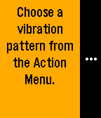

# actionmenu-multilevel

Example app demonstrating simple use of the `ActionMenu` API to allow an app user
to choose from a number of different types of vibration, including a nested 
`ActionMenu` for custom vibration patterns.
